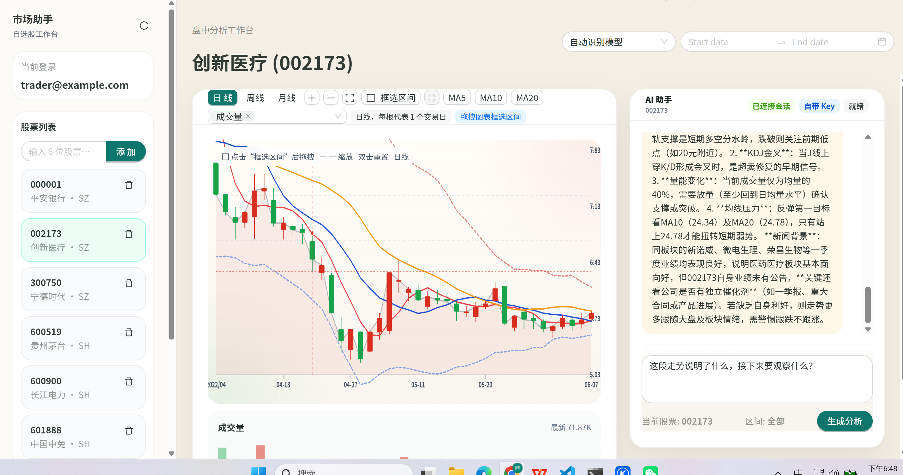

# Market Project

Market Project 是一个面向 A 股场景的自托管行情分析工作台，核心能力是把自选股、K 线图表和 AI 副驾驶放在同一个界面里。

它不是一个托管式 SaaS，而是一个偏本地部署、偏个人掌控的数据与分析工具：

- 用 Docker 直接启动
- PostgreSQL 和 Redis 由你自己掌控
- 用户在浏览器里输入自己的 OpenAI / DeepSeek Key
- 用图表上下文、股票列表和 AI 结论完成分析闭环

## 项目截图




## 核心特性

- 自托管 Web 应用，包含登录、自选股、图表和 AI 分析
- A 股日线 OHLC 同步，带备用行情源自动回退
- 用户自带 AI Key，保存在浏览器本地
- 自动识别 OpenAI / DeepSeek Key
- PostgreSQL 存储用户、股票、OHLC 历史和 AI 会话
- Redis 负责缓存、Token 黑名单和限流状态
- 支持 Docker Compose 本地启动
- 提供 Kubernetes 与 Minikube 部署清单

## 为什么做这个项目

很多行情产品只提供图表，很多 AI 包装层又脱离真实的价格结构。

这个项目想解决的是中间这段空白：

- 图表仍然是主界面，而不是 AI 聊天框
- AI 是分析助手，不是替代品
- 启动和部署尽量简单，适合个人自托管
- 不把用户锁死在单一模型厂商上

## 架构概览

```text
frontend  ->  api-go  ->  ai-go
   |           |           |
   |           |           -> 模型提供方 API
   |           |
   |           -> PostgreSQL
   |           -> Redis
   |
   -> 浏览器本地保存的 AI Key
```

各服务职责：

- `frontend`：React 前端，自选股、图表、AI 面板
- `api-go`：认证、股票列表、OHLC 查询、管理接口、转发到 AI 服务
- `ai-go`：模型识别、AI 生成、会话记录
- `postgres`：持久化业务与行情数据
- `redis`：缓存、请求状态、限流与黑名单

## 快速开始

### 方案一：Docker Compose

适合大多数本地体验和自托管场景。

前置要求：

- Docker
- Docker Compose

启动：

```bash
docker compose up -d
```

访问地址：

- 前端：`http://localhost:4173`
- API 健康检查：`http://localhost:8080/health`
- AI 服务健康检查：`http://localhost:8081/health`

停止：

```bash
docker compose down
```

清空本地数据：

```bash
docker compose down -v
```

### 方案二：Minikube

适合想在本地模拟 Kubernetes 运行方式的场景。

前置要求：

- Docker
- Minikube
- kubectl

启动并部署：

```bash
minikube start --driver=docker
kubectl apply -f deploy/minikube/01-base.yaml
kubectl apply -f deploy/minikube/02-infra.yaml
kubectl apply -f deploy/minikube/03-apps.yaml
kubectl get pods -n market-project
```

查看访问地址：

```bash
minikube ip
```

然后打开：

```text
http://<minikube-ip>:30080
```

如果你在 WSL2 下运行 Minikube，或者宿主机访问不到 Minikube IP，可以改用端口转发：

```bash
kubectl port-forward -n market-project --address 0.0.0.0 svc/frontend 30080:80
```

然后打开：

```text
http://127.0.0.1:30080
```

## 默认账号

首次本地登录可直接使用：

- 邮箱：`trader@example.com`
- 密码：`market123456`

## 内置基础设施

无论是 Docker Compose 还是 Minikube，默认都会一起启动：

- PostgreSQL 16
- Redis 7

Docker Compose 默认暴露端口：

- `4173` 前端
- `8080` api-go
- `8081` ai-go
- `5432` PostgreSQL
- `6379` Redis

Docker 持久化卷：

- `postgres-data`
- `redis-data`

## AI Key 与模型策略

项目支持两种 AI 使用方式：

1. 通过环境变量配置服务端模型 Key
2. 由每个用户在前端输入自己的 Key

浏览器输入的 Key 只保存在本地浏览器存储里，并随 Copilot 请求发送到后端。在自动识别模式下，后端会判断这个 Key 属于 OpenAI 还是 DeepSeek，并自动匹配对应 Provider。

当前默认模型：

```env
DEFAULT_AI_PROVIDER=deepseek
OPENAI_MODEL=gpt-5.5
DEEPSEEK_MODEL=deepseek-v4-flash
```

可选环境变量：

```env
OPENAI_API_KEY=
DEEPSEEK_API_KEY=
```

## 行情数据策略

股票列表和 OHLC 同步做了降级处理，尽量避免因为单一外部源波动导致整个应用不可用：

- 主行情源：Eastmoney
- 备用行情源：Tencent 日 K
- 本地已有 OHLC 数据时，优先返回已有数据
- 外部同步临时失败时，股票仍可加入自选列表

这意味着：

- 已加入列表的股票，外部源短时失败时不会直接整页报废
- 新增股票时，系统会尽量马上拉到行情；主源失败会自动切换备用源

## 部署文件

仓库中已经包含开源可用的部署文件：

- `docker-compose.yml`
- `deploy/minikube/01-base.yaml`
- `deploy/minikube/02-infra.yaml`
- `deploy/minikube/03-apps.yaml`
- `deploy/k8s/namespace.yaml`
- `deploy/k8s/configmap.yaml`
- `deploy/k8s/api-go.yaml`
- `deploy/k8s/ai-go.yaml`
- `deploy/k8s/frontend.yaml`
- `deploy/k8s/secret.example.yaml`

当前默认使用公开镜像：

- `donglog/market-backend:latest`
- `donglog/market-frontend:latest`

## 目录结构

```text
apps/backend    Go API 服务与 AI 服务
apps/frontend   React 前端
deploy          Docker 与 Kubernetes 部署文件
docs            设计说明与补充资料
output          本地截图与调试产物
```

## 运行说明

- 前端通过 `/api` 代理到 `api-go`
- `api-go` 再把 Copilot 相关请求转发给 `ai-go`
- PostgreSQL 存储用户、股票、OHLC 与 AI 会话
- Redis 存储缓存、限流状态和 Token 黑名单
- Minikube 清单面向本地使用，不是生产高可用方案

## 推荐使用方式

- 本地体验优先使用 Docker Compose
- 需要模拟集群环境时再使用 Minikube
- Provider Key 不要写进仓库文件
- 个人使用或演示环境优先使用浏览器输入 Key
- 生产环境建议从 `latest` 进一步收敛到固定 digest

## Roadmap

- 更完整的图表交互和标注能力
- 更稳定的股票搜索和初始引导
- 更清晰的 Provider 状态展示
- 更多云上 Kubernetes 部署模板

## 参与贡献

如果要继续扩展项目，建议遵守几个原则：

- 保持 Docker-first 的启动体验
- 不把前端设计成单一模型厂商绑定
- 优先做“可降级”的稳定方案，而不是脆弱的强依赖链路
- 用户侧流程尽量保持简单、直接、可自托管

## License

正式公开仓库前，建议补充 `LICENSE` 文件。
